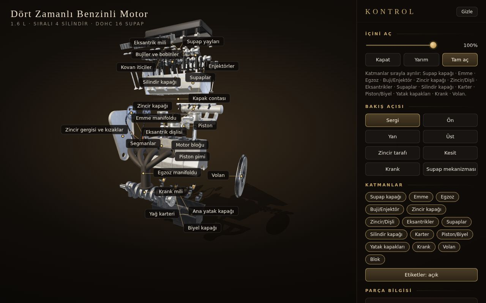

# Mekanik Modeller

Makine mühendisliği eğitiminde önemli yeri olan klasik makinelerin tarayıcıda çalışan, interaktif 3D modelleri. Her model gerçek oranlarla hareket eder, parça parça sökülüp takılabilir ve her parçanın ne işe yaradığını anlatır. Arayüz Türkçedir.

## Modeller

### ⚙️ İçten Yanmalı Motor
[`ic-yanmali-motor/`](ic-yanmali-motor/)



1.6 L, sıralı 4 silindir, DOHC 16 supaplı 4 zamanlı benzinli motor.
- **Çalışan mekanizma:** Krank-biyel-piston, 1:2 zamanlama zinciri ve gerçek kam profili.
- **Sökme/takma:** 15 katman gerçek söküm sırasıyla ayrılır.
- **Kesit görünümü:** Kesilen yüzeyler teknik çizimdeki gibi taralıdır.
- **Termodinamik:** Yanma ve gaz akışı, canlı P-V diyagramı.
- **Öğrenme:** Rehberli tur ve mini sınav.

### Sıradakiler
- Mekanik saat
- Şanzıman
- Diferansiyel

## Çalıştırma
Her model kendi klasöründe bağımsız bir projedir:

```bash
cd ic-yanmali-motor
npm install
npm run dev
```

Ayrıntılar modelin kendi README dosyasında.
